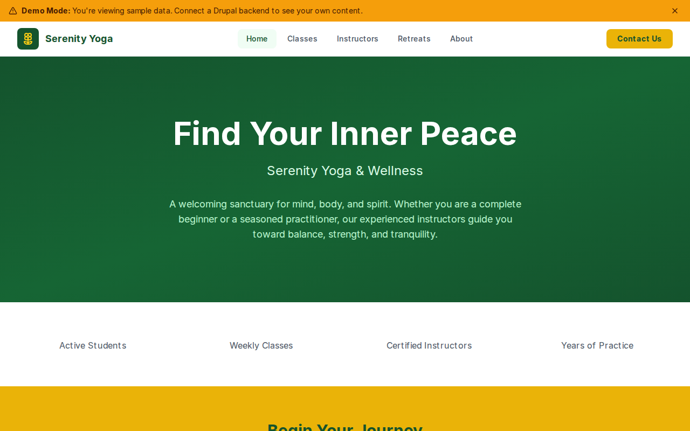

# Decoupled Yoga

A modern yoga studio website built with Next.js and Drupal, designed for yoga studios, wellness centers, and meditation spaces. Showcase your class schedule, introduce your instructors, and promote retreats to attract new students and deepen engagement with your community.



## Features

- **Yoga Classes** -- Browse class offerings with level, duration, schedule, and instructor details (Vinyasa Flow, Restorative Yoga, Power Yoga)
- **Instructor Profiles** -- Highlight your teaching team with specialties, certifications, and personal bios
- **Wellness Retreats** -- Promote retreats with dates, locations, pricing, and availability (Bali, Sedona, local day retreats)
- **Homepage Hero & Stats** -- Welcome visitors with a branded hero section and key studio statistics (1,800+ active students, 40+ weekly classes)
- **Contact Page** -- Studio contact info, hours, and a message form for inquiries
- **Demo Mode** -- Preview the full site with sample content, no backend required

## Quick Start

```bash
npx degit nicobrinkkemper/decoupled-yoga my-yoga-studio
cd my-yoga-studio
npm install
npm run setup
npm run dev
```

Visit [http://localhost:3000](http://localhost:3000)

## Manual Setup

<details>
<summary>Click to expand manual setup steps</summary>

### Authenticate with Decoupled.io

```bash
npx decoupled-cli@latest auth login
```

### Create a Drupal space

```bash
npx decoupled-cli@latest spaces create "Serenity Yoga Studio"
```

Note the space ID returned (e.g., `Space ID: 1234`). Wait ~90 seconds for provisioning.

### Configure environment

```bash
npx decoupled-cli@latest spaces env 1234 --write .env.local
```

### Import content

```bash
npm run setup-content
```

This imports the following sample content:

- **Classes:** Vinyasa Flow, Restorative Yoga, Power Yoga
- **Instructors:** Maya Patel (Vinyasa & Meditation), Elena Vasquez (Restorative & Therapeutic), James Nakamura (Power Yoga & Arm Balances)
- **Retreats:** Bali Wellness Retreat ($2,800), Sedona Desert Renewal ($1,500), Weekend Reset ($175)
- **Pages:** About Serenity Yoga Studio, New Student Guide

</details>

## Content Types

### Yoga Class
| Field | Type | Description |
|-------|------|-------------|
| Title | string | Class name (e.g., "Vinyasa Flow") |
| Body | text | Full class description with HTML |
| Level | string | Difficulty level (Beginner, All Levels, Intermediate/Advanced) |
| Duration | string | Class length (e.g., "60 minutes") |
| Schedule | string | Weekly schedule (e.g., "Mon/Wed/Fri 7:00 AM") |
| Instructor | string | Instructor name |
| Image | image | Class photo |

### Instructor
| Field | Type | Description |
|-------|------|-------------|
| Title | string | Instructor name |
| Body | text | Bio and teaching philosophy |
| Specialty | string | Teaching focus (e.g., "Vinyasa Flow & Meditation") |
| Email | string | Contact email |
| Certifications | string | Credentials (e.g., "E-RYT 500, YACEP") |
| Teaching Since | string | Year started teaching |
| Photo | image | Instructor headshot |

### Retreat
| Field | Type | Description |
|-------|------|-------------|
| Title | string | Retreat name |
| Body | text | Full description with inclusions |
| Retreat Date | datetime | Start date |
| End Date | datetime | End date |
| Location | string | Venue or destination |
| Price | string | Cost per person |
| Spots Available | string | Remaining capacity |
| Image | image | Retreat photo |

## Customization

### Colors & Branding
Edit `tailwind.config.js` to customize the studio's color palette, fonts, and spacing. The default theme uses greens and warm yellows.

### Content Structure
Modify `data/yoga-content.json` to add new classes, instructors, or retreats, or adjust existing sample content.

### Components
React components are in `app/components/`. Key files:
- `HomepageRenderer.tsx` -- Landing page layout with hero, stats, and CTA
- `ClassCard.tsx` -- Class listing card
- `InstructorCard.tsx` -- Instructor profile card
- `RetreatCard.tsx` -- Retreat listing card
- `Header.tsx` -- Navigation bar

## Demo Mode

Demo mode displays the full site with mock content, no Drupal backend required.

### Enable Demo Mode

```bash
NEXT_PUBLIC_DEMO_MODE=true npm run dev
```

Or add to `.env.local`:
```
NEXT_PUBLIC_DEMO_MODE=true
```

### Removing Demo Mode

To convert to a production app with real data:

1. Delete `lib/demo-mode.ts`
2. Delete `data/mock/` directory
3. Delete `app/components/DemoModeBanner.tsx`
4. Remove `DemoModeBanner` from `app/layout.tsx`
5. Remove demo mode checks from `app/api/graphql/route.ts`

## Deployment

### Vercel (Recommended)
[](https://vercel.com/new/clone?repository-url=https://github.com/nicobrinkkemper/decoupled-yoga&project-name=serenity-yoga-studio)

Set `NEXT_PUBLIC_DEMO_MODE=true` in Vercel environment variables for a demo deployment.

### Other Platforms
Works with any Node.js hosting platform that supports Next.js.

## Documentation

- [Decoupled.io Docs](https://www.decoupled.io/docs)
- [Next.js Documentation](https://nextjs.org/docs)
- [Drupal GraphQL](https://www.decoupled.io/docs/graphql)

## License

MIT
